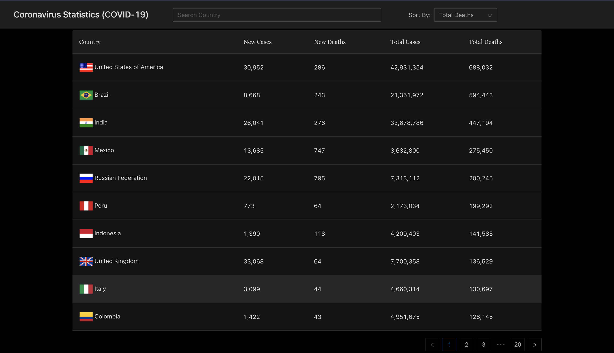

# Coronavirus (Covid-19) Statistics

## 🚗 Getting Started

```Note
These instructions will get you a copy of the
project up and running on your local machine
for development and testing purposes.
```

## 🔨 Prerequisites

- node >= 8.9.0
- typescript >= 3.0
- yarn >= 1.14.0 or npm >= 6.7.0
- git >= 2.10.1

## Sample



## 🔧 Features

Consumes this [API](https://documenter.getpostman.com/view/10808728/SzS8rjbc?version=latest)

- [x] Global statistics.
- [x] Country statistics.
- [ ] Graphical & Chart representations.
- [ ] Rss integration.

## 🔧 Development Tools

- [VS Code](https://code.visualstudio.com/)
- [Chrome](https://www.google.com/chrome/)
- [React Developer Tools](https://chrome.google.com/webstore/detail/react-developer-tools/fmkadmapgofadopljbjfkapdkoienihi?hl=en-US)
- [Redux DevTools](https://chrome.google.com/webstore/detail/redux-devtools/lmhkpmbekcpmknklioeibfkpmmfibljd?hl=en-US)
- [Node](https://nodejs.org/en/)

## 💻 Running Project

### `yarn install`

Install the packages

### `yarn start:local`

Runs the app in local mode.Open [http://localhost:3000](http://localhost:3000) to view it in the browser.

The page will reload if you make edits. You will also see any lint errors in the console.

### `yarn test`

Launches the test runner in the interactive watch mode.

### `yarn build:prod`

Builds the app for production to the `build` folder.
It correctly bundles React in production mode and optimizes the build for the best performance.

The build is minified and the filenames include the hashes.
Your app is ready to be deployed!

See the section about [deployment](https://facebook.github.io/create-react-app/docs/deployment) for more information.

### `yarn tslint`

Auto fix tslint errors.
